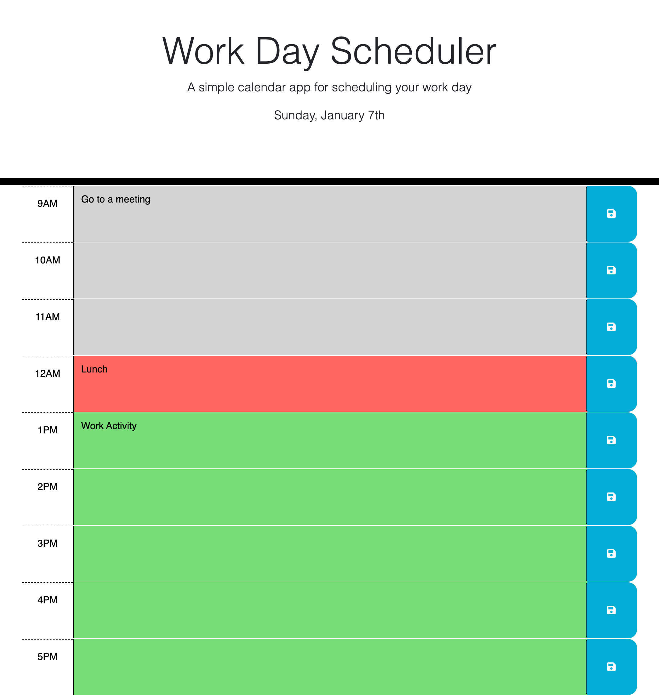

# Work Day Scheduler
This is a repo to host a work day calendar/scheduling app.
The app will show time blocks for each hour of the day, where user can schedule events for time block and save them.
Events will persist day to day and time blocks states are updated to past/present/future based on currrent time.

[https://lukegarnsey.github.io/work-day-scheduler/](https://lukegarnsey.github.io/work-day-scheduler/)

